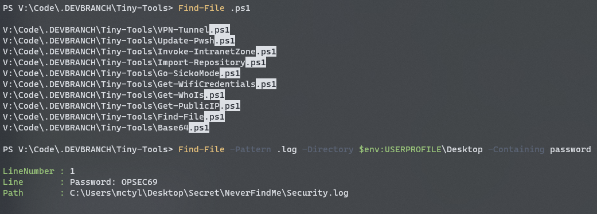
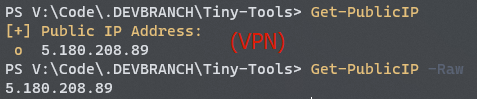
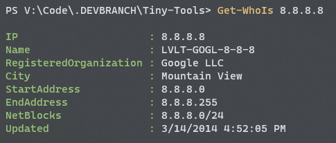
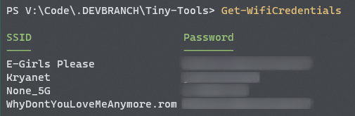
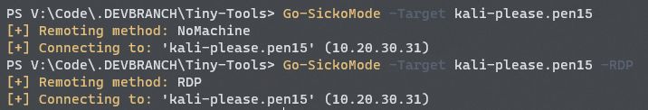
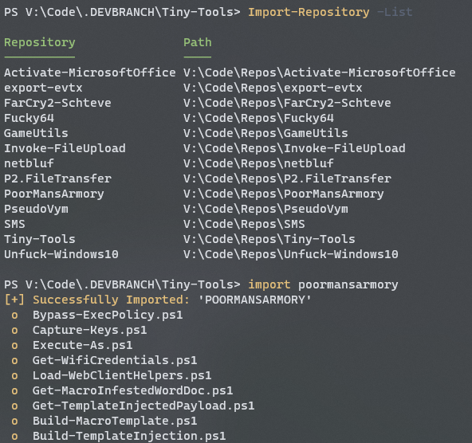
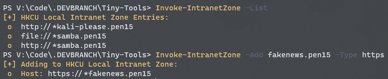
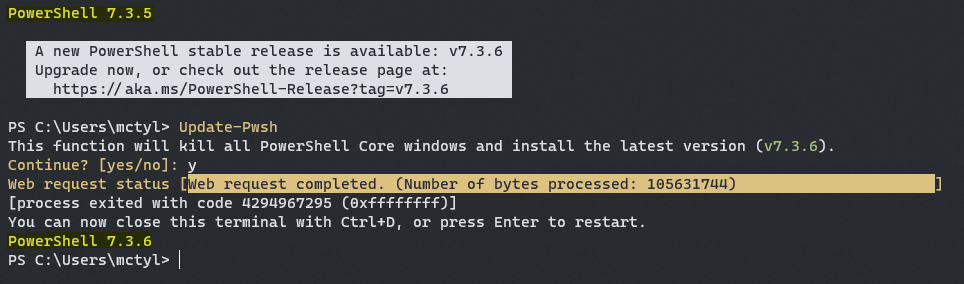
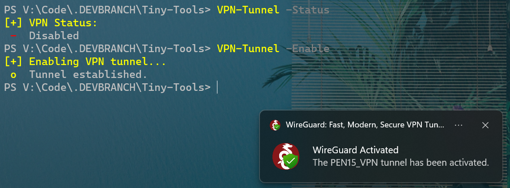

# Tiny-Tools
Collection of small (but useful) PowerShell tools and scripts that either...

- **(a)** I'm too lazy... 
- **(b)** aren't quite robust enough...

to warrant standalone repositories.

## Overview

| Name| Version | Description |
| --- | --- | --- |
| `Base64.ps1` | v1.2.0 | Base64 encode/decode strings. |
| `Find-File.ps1` | v1.1.1 | Recursively search for and through files. |
| `Get-PublicIP.ps1` | v1.2.5 | Quickly return the host's public IP address. |
| `Get-Whois.ps1` | v1.2.5 | Perform a Whois lookup on an input IP address. |
| `Get-WifiCredentials.ps1` | v1.0.1 | Return all stored WiFi passwords on the host. |
| `Go-SickoMode.ps1` | v2.0.0 | Remote into known workstations via NoMachine or RDP. |
| `Import-Repository.ps1` | v1.0.0 | Load available PowerShell-based repositories into the current session. |
| `Invoke-IntranetZone.ps1` | v1.0.0 | List, add, and remove hosts to the Local Intranet Zone via CLI. |
| `Update-Pwsh.ps1` | v1.1.1 | Automatically update PowerShell Core version on Windows. |
| `VPN-Tunnel.ps1` | v1.1.5 | Easily toggle WireGuard VPN tunnels. |

## Gallery

#### **Base64.ps1:**

---

#### **Find-File.ps1:**

---

#### **Get-PublicIP.ps1:**

---

#### **Get-Whois.ps1:**

#### **Get-WifiCredentials.ps1:**

---

#### **Go-SickoMode.ps1:**

---

#### **Import-Repository:**

---

#### **Invoke-IntranetZone.ps1:**

---

#### **Update-Pwsh.ps1:**

---

#### **VPN-Tunnel.ps1:**
